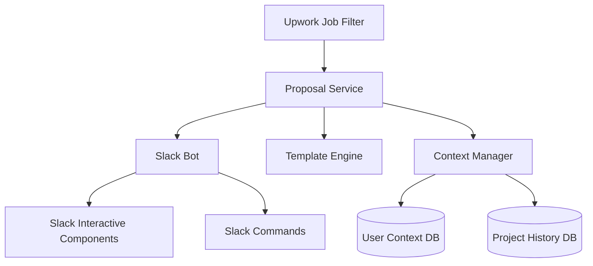
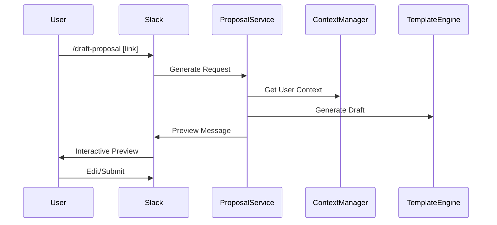

# Technical Requirements: Automated Upwork Proposal System
> Technical specification and implementation details for the Automated Upwork Proposal System

## System Architecture

### High-Level Overview


## Core Technical Components

### 1. Database Requirements

#### MongoDB Selection Rationale
- Flexible schema for project/template data
- Strong text search capabilities
- JSON document native support
- Easy field modification and updates

#### Collections Structure
```javascript
// Users Collection
{
  _id: ObjectId,
  profile: {
    name: String,
    professionalSummary: String,
    skills: Array,
    hourlyRate: Number,
    experienceYears: Number,
    certifications: Array,
    achievements: Array
  },
  settings: {
    notificationPreferences: Object,
    defaultTemplates: Array
  },
  metadata: {
    createdAt: Date,
    updatedAt: Date
  }
}

// Projects Collection
{
  _id: ObjectId,
  userId: ObjectId,
  title: String,
  description: String,
  technologies: Array,
  industry: String,
  timeline: {
    start: Date,
    end: Date
  },
  budget: Number,
  outcomes: Array,
  keywords: Array,
  metrics: Array,
  metadata: {
    createdAt: Date,
    updatedAt: Date
  }
}

// Templates Collection
{
  _id: ObjectId,
  name: String,
  type: String,
  sections: Array,
  variables: Array,
  maxLength: Number,
  defaultContext: Object,
  metadata: {
    createdAt: Date,
    updatedAt: Date,
    version: Number
  }
}
```

### 2. Required APIs and Services

#### External Services
- Slack Bolt API
- OpenAI API (optional)
- AWS S3 (template storage)
- Existing Upwork RSS integration

#### Core Dependencies
```json
{
  "dependencies": {
    "@slack/bolt": "^3.x.x",
    "mongoose": "^6.x.x",
    "handlebars": "^4.x.x",
    "natural": "^5.x.x",
    "jest": "^27.x.x"
  }
}
```

### 3. TypeScript Interfaces

```typescript
// Core Interfaces
interface UserProfile {
    id: string;
    name: string;
    professionalSummary: string;
    skills: Skill[];
    hourlyRate: number;
    experienceYears: number;
    certifications: string[];
    achievements: Achievement[];
}

interface Project {
    id: string;
    title: string;
    description: string;
    technologies: string[];
    industry: string;
    timeline: {
        start: Date;
        end: Date;
    };
    budget: number;
    outcomes: string[];
    keywords: string[];
    metrics: Metric[];
}

interface Template {
    id: string;
    name: string;
    type: ProposalType;
    sections: Section[];
    variables: Variable[];
    maxLength: number;
    defaultContext: Record<string, any>;
}
```

## Slack Integration Specifications

### 1. Slash Commands
```typescript
interface SlashCommand {
    command: string;
    description: string;
    handler: (args: string[]) => Promise<SlackResponse>;
}

const commands: SlashCommand[] = [
    {
        command: '/draft-proposal',
        description: 'Generate new proposal from job link',
        args: ['job-link']
    },
    {
        command: '/list-templates',
        description: 'View available proposal templates'
    },
    {
        command: '/manage-projects',
        description: 'Manage project database'
    },
    {
        command: '/update-profile',
        description: 'Update user context'
    }
];
```

### 2. Interactive Components

#### Proposal Preview Block
```typescript
interface ProposalPreviewBlock {
    proposal_text: string;
    metadata: {
        word_count: number;
        char_count: number;
        relevance_score: number;
        matching_projects: string[];
    };
    actions: {
        edit: Button;
        submit: Button;
        select_project: ProjectSelector;
        select_template: TemplateSelector;
    };
}
```

#### Modal Components
```typescript
interface EditModal {
    sections: {
        introduction: TextSection;
        approach: TextSection;
        experience: TextSection;
        timeline: TextSection;
        closing: TextSection;
    };
    controls: {
        save: Button;
        cancel: Button;
        preview: Button;
    };
    metadata: {
        char_count: Counter;
        word_count: Counter;
    };
}
```

### 3. Message Flows

#### Proposal Generation Flow


### 4. Interactive Components Layout

```typescript
interface ProposalThread {
    parent: {
        job_details: JobBlock;
        relevance_metrics: MetricsBlock;
    };
    proposal: {
        preview: ProposalPreviewBlock;
        actions: ActionBlock;
        collaboration: {
            comments: CommentThread;
            suggestions: SuggestionList;
        };
    };
}
```

### 5. State Management

```typescript
interface ProposalState {
    id: string;
    status: 'draft' | 'review' | 'approved' | 'submitted';
    version: number;
    history: EditHistory[];
    collaborators: string[];
    thread_ts: string;
    metadata: {
        created_at: Date;
        last_modified: Date;
        modified_by: string;
    };
}
```

### 6. Notification System

```typescript
interface NotificationConfig {
    events: {
        new_proposal_ready: boolean;
        review_requested: boolean;
        changes_made: boolean;
        proposal_approved: boolean;
    };
    channels: {
        default: string;
        reviews: string;
        submissions: string;
    };
    mentions: {
        reviewers: string[];
        approvers: string[];
    };
}
```

### 7. Error Handling

```typescript
interface SlackErrorHandler {
    handleCommandError: (error: Error) => SlackMessage;
    handleInteractionError: (error: Error) => SlackMessage;
    handleValidationError: (error: ValidationError) => SlackMessage;
    handleAPIError: (error: APIError) => SlackMessage;
}
```

### 8. Rate Limiting and Performance

```typescript
interface RateLimitConfig {
    max_proposals_per_hour: number;
    max_edits_per_proposal: number;
    concurrent_drafts_limit: number;
    api_rate_limits: {
        slack: number;
        template_generation: number;
        context_matching: number;
    };
}
```

### 9. Testing Scenarios

```typescript
describe('Slack Integration', () => {
    describe('Command Handling', () => {
        it('should handle /draft-proposal command');
        it('should validate job link');
        it('should handle missing permissions');
    });

    describe('Interactive Components', () => {
        it('should update proposal preview');
        it('should handle concurrent edits');
        it('should maintain state');
    });

    describe('Error Scenarios', () => {
        it('should handle timeout gracefully');
        it('should retry failed operations');
        it('should notify users of errors');
    });
});
```

## Implementation Challenges and Solutions

### 1. Context Matching Algorithm

```typescript
interface MatchingScore {
    relevance: number;
    projectMatches: Project[];
    skillMatches: string[];
}

class ContextMatcher {
    async calculateRelevance(
        jobPost: JobPost, 
        userContext: UserProfile
    ): Promise<MatchingScore>;
    
    async findRelevantProjects(
        jobKeywords: string[], 
        projects: Project[]
    ): Promise<Project[]>;
}
```

### 2. Template Processing System

```typescript
interface TemplateProcessor {
    compile(template: Template, context: any): string;
    validate(content: string): ValidationResult;
    trackChanges(original: string, modified: string): Changes[];
}
```

## Implementation Phases

### Phase 1: Foundation (2-3 weeks)
- [ ] MongoDB setup and configuration
- [ ] Basic Slack command infrastructure
- [ ] Template engine implementation
- [ ] User context management system

### Phase 2: Core Features (3-4 weeks)
- [ ] Proposal generation logic
- [ ] Interactive Slack components
- [ ] Project database implementation
- [ ] Matching algorithm v1

### Phase 3: Enhancement (2-3 weeks)
- [ ] Collaborative editing features
- [ ] Version control system
- [ ] Analytics tracking
- [ ] Test suite implementation

## Security Measures

### Data Protection
- AES-256 encryption for sensitive data
- Role-based access control
- Daily automated backups
- Comprehensive audit logging

### API Security
- Rate limiting implementation
- JWT token authentication
- Request validation middleware
- Structured error handling

## Testing Strategy

### Unit Tests
```typescript
describe('TemplateProcessor', () => {
    it('should correctly process template variables');
    it('should validate character limits');
    it('should handle markdown formatting');
});

describe('ContextMatcher', () => {
    it('should calculate accurate relevance scores');
    it('should find matching projects');
    it('should handle edge cases');
});
```

## Monitoring and Maintenance

### Key Metrics
- API response times (target: <500ms)
- Template rendering (target: <200ms)
- Database query performance
- Error rate threshold (target: <1%)

### Logging Strategy
- Application logs (Winston/Bunyan)
- User action tracking
- System event monitoring
- Error tracking (Sentry)

## Next Steps
1. [ ] Finalize database schema
2. [ ] Create detailed API specification
3. [ ] Develop matching algorithm prototype
4. [ ] Design template engine architecture

## Notes
- Document last updated: [DATE]
- Status: Planning Phase
- Lead Developer: [TBD]
- Technical Contact: [TBD] 