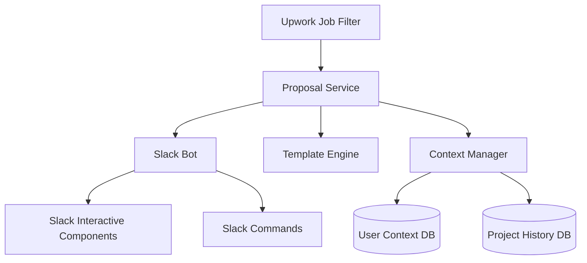
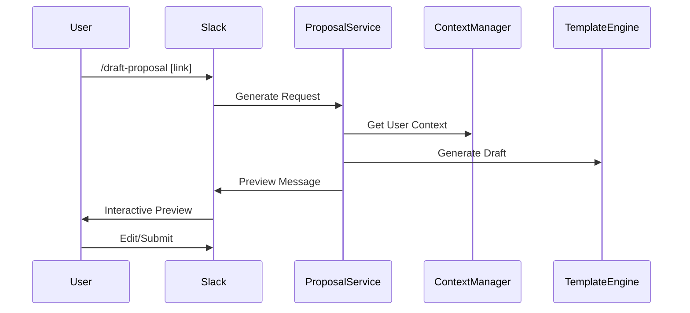

# Technical Requirements: Automated Upwork Proposal System
> Technical specification and implementation details for the Automated Upwork Proposal System

## System Architecture

### High-Level Overview


## Core Technical Components

### 1. Database Requirements

#### MongoDB Selection Rationale
- Flexible schema for project/template data
- Strong text search capabilities
- JSON document native support
- Easy field modification and updates

#### Collections Structure
```javascript
// Users Collection
{
  _id: ObjectId,
  profile: {
    name: String,
    professionalSummary: String,
    skills: Array,
    hourlyRate: Number,
    experienceYears: Number,
    certifications: Array,
    achievements: Array
  },
  settings: {
    notificationPreferences: Object,
    defaultTemplates: Array
  },
  metadata: {
    createdAt: Date,
    updatedAt: Date
  }
}

// Projects Collection
{
  _id: ObjectId,
  userId: ObjectId,
  title: String,
  description: String,
  technologies: Array,
  industry: String,
  timeline: {
    start: Date,
    end: Date
  },
  budget: Number,
  outcomes: Array,
  keywords: Array,
  metrics: Array,
  metadata: {
    createdAt: Date,
    updatedAt: Date
  }
}

// Templates Collection
{
  _id: ObjectId,
  name: String,
  type: String,
  sections: Array,
  variables: Array,
  maxLength: Number,
  defaultContext: Object,
  metadata: {
    createdAt: Date,
    updatedAt: Date,
    version: Number
  }
}
```

### 2. Required APIs and Services

#### External Services
- Slack Bolt API
- OpenAI API (optional)
- AWS S3 (template storage)
- Existing Upwork RSS integration

#### Core Dependencies
```json
{
  "dependencies": {
    "@slack/bolt": "^3.x.x",
    "mongoose": "^6.x.x",
    "handlebars": "^4.x.x",
    "natural": "^5.x.x",
    "jest": "^27.x.x"
  }
}
```

### 3. TypeScript Interfaces

```typescript
// Core Interfaces
interface UserProfile {
    id: string;
    name: string;
    professionalSummary: string;
    skills: Skill[];
    hourlyRate: number;
    experienceYears: number;
    certifications: string[];
    achievements: Achievement[];
}

interface Project {
    id: string;
    title: string;
    description: string;
    technologies: string[];
    industry: string;
    timeline: {
        start: Date;
        end: Date;
    };
    budget: number;
    outcomes: string[];
    keywords: string[];
    metrics: Metric[];
}

interface Template {
    id: string;
    name: string;
    type: ProposalType;
    sections: Section[];
    variables: Variable[];
    maxLength: number;
    defaultContext: Record<string, any>;
}
```

## Slack Integration Specifications

### 1. Slash Commands
```typescript
interface SlashCommand {
    command: string;
    description: string;
    handler: (args: string[]) => Promise<SlackResponse>;
}

const commands: SlashCommand[] = [
    {
        command: '/draft-proposal',
        description: 'Generate new proposal from job link',
        args: ['job-link']
    },
    {
        command: '/list-templates',
        description: 'View available proposal templates'
    },
    {
        command: '/manage-projects',
        description: 'Manage project database'
    },
    {
        command: '/update-profile',
        description: 'Update user context'
    }
];
```

### 2. Interactive Components

#### Proposal Preview Block
```typescript
interface ProposalPreviewBlock {
    proposal_text: string;
    metadata: {
        word_count: number;
        char_count: number;
        relevance_score: number;
        matching_projects: string[];
    };
    actions: {
        edit: Button;
        submit: Button;
        select_project: ProjectSelector;
        select_template: TemplateSelector;
    };
}
```

#### Modal Components
```typescript
interface EditModal {
    sections: {
        introduction: TextSection;
        approach: TextSection;
        experience: TextSection;
        timeline: TextSection;
        closing: TextSection;
    };
    controls: {
        save: Button;
        cancel: Button;
        preview: Button;
    };
    metadata: {
        char_count: Counter;
        word_count: Counter;
    };
}
```

### 3. Message Flows

#### Proposal Generation Flow


### 4. Interactive Components Layout

```typescript
interface ProposalThread {
    parent: {
        job_details: JobBlock;
        relevance_metrics: MetricsBlock;
    };
    proposal: {
        preview: ProposalPreviewBlock;
        actions: ActionBlock;
        collaboration: {
            comments: CommentThread;
            suggestions: SuggestionList;
        };
    };
}
```

### 5. State Management

```typescript
interface ProposalState {
    id: string;
    status: 'draft' | 'review' | 'approved' | 'submitted';
    version: number;
    history: EditHistory[];
    collaborators: string[];
    thread_ts: string;
    metadata: {
        created_at: Date;
        last_modified: Date;
        modified_by: string;
    };
}
```

### 6. Notification System

```typescript
interface NotificationConfig {
    events: {
        new_proposal_ready: boolean;
        review_requested: boolean;
        changes_made: boolean;
        proposal_approved: boolean;
    };
    channels: {
        default: string;
        reviews: string;
        submissions: string;
    };
    mentions: {
        reviewers: string[];
        approvers: string[];
    };
}
```

### 7. Error Handling

```typescript
interface SlackErrorHandler {
    handleCommandError: (error: Error) => SlackMessage;
    handleInteractionError: (error: Error) => SlackMessage;
    handleValidationError: (error: ValidationError) => SlackMessage;
    handleAPIError: (error: APIError) => SlackMessage;
}
```

### 8. Rate Limiting and Performance

```typescript
interface RateLimitConfig {
    max_proposals_per_hour: number;
    max_edits_per_proposal: number;
    concurrent_drafts_limit: number;
    api_rate_limits: {
        slack: number;
        template_generation: number;
        context_matching: number;
    };
}
```

### 9. Testing Scenarios

```typescript
describe('Slack Integration', () => {
    describe('Command Handling', () => {
        it('should handle /draft-proposal command');
        it('should validate job link');
        it('should handle missing permissions');
    });

    describe('Interactive Components', () => {
        it('should update proposal preview');
        it('should handle concurrent edits');
        it('should maintain state');
    });

    describe('Error Scenarios', () => {
        it('should handle timeout gracefully');
        it('should retry failed operations');
        it('should notify users of errors');
    });
});
```

## Implementation Challenges and Solutions

### 1. Context Matching Algorithm

```typescript
interface MatchingScore {
    relevance: number;
    projectMatches: Project[];
    skillMatches: string[];
}

class ContextMatcher {
    async calculateRelevance(
        jobPost: JobPost, 
        userContext: UserProfile
    ): Promise<MatchingScore>;
    
    async findRelevantProjects(
        jobKeywords: string[], 
        projects: Project[]
    ): Promise<Project[]>;
}
```

### 2. Template Processing System

```typescript
interface TemplateProcessor {
    compile(template: Template, context: any): string;
    validate(content: string): ValidationResult;
    trackChanges(original: string, modified: string): Changes[];
}
```

## Implementation Phases

### Phase 1: Foundation (2-3 weeks)
- [ ] MongoDB setup and configuration
- [ ] Basic Slack command infrastructure
- [ ] Template engine implementation
- [ ] User context management system

### Phase 2: Core Features (3-4 weeks)
- [ ] Proposal generation logic
- [ ] Interactive Slack components
- [ ] Project database implementation
- [ ] Matching algorithm v1

### Phase 3: Enhancement (2-3 weeks)
- [ ] Collaborative editing features
- [ ] Version control system
- [ ] Analytics tracking
- [ ] Test suite implementation

## Security Measures

### Data Protection
- AES-256 encryption for sensitive data
- Role-based access control
- Daily automated backups
- Comprehensive audit logging

### API Security
- Rate limiting implementation
- JWT token authentication
- Request validation middleware
- Structured error handling

## Testing Strategy

### Unit Tests
```typescript
describe('TemplateProcessor', () => {
    it('should correctly process template variables');
    it('should validate character limits');
    it('should handle markdown formatting');
});

describe('ContextMatcher', () => {
    it('should calculate accurate relevance scores');
    it('should find matching projects');
    it('should handle edge cases');
});
```

## Monitoring and Maintenance

### Key Metrics
- API response times (target: <500ms)
- Template rendering (target: <200ms)
- Database query performance
- Error rate threshold (target: <1%)

### Logging Strategy
- Application logs (Winston/Bunyan)
- User action tracking
- System event monitoring
- Error tracking (Sentry)

## Next Steps
1. [ ] Finalize database schema
2. [ ] Create detailed API specification
3. [ ] Develop matching algorithm prototype
4. [ ] Design template engine architecture

## Notes
- Document last updated: [DATE]
- Status: Planning Phase
- Lead Developer: [TBD]
- Technical Contact: [TBD] 

interface ThreadedProposal {
    thread_ts: string;  // Slack thread timestamp
    job_post: {
        title: string;
        link: string;
        budget: number;
    };
    proposal: {
        draft: string;
        status: 'drafting' | 'ready' | 'submitted';
        last_edited: Date;
    };
}

// Slack message structure
const jobPostMessage = {
    blocks: [
        {
            type: "section",
            text: {
                type: "mrkdwn",
                text: "*New Job:* ${job.title}\n💰 Budget: $${job.budget}"
            }
        },
        {
            type: "actions",
            elements: [
                {
                    type: "button",
                    text: {
                        type: "plain_text",
                        text: "Draft Proposal"
                    },
                    action_id: "draft_proposal"
                }
            ]
        }
    ]
}; 

### 7. Proposal Structure and Data Sources

#### Proposal Sections
```typescript
interface ProposalStructure {
    sections: {
        introduction: {
            content: string;
            maxLength: number;  // typically 2-3 sentences
            dataPoints: {
                jobTitle: string;        // from job post
                clientIndustry?: string; // from job analysis
                specificProblem: string; // from job description
            }
        },
        relevantExperience: {
            content: string;
            maxLength: number;  // typically 2-3 paragraphs
            dataPoints: {
                matchingProjects: Project[];     // from user's project history
                relevantSkills: string[];        // from user profile + job requirements
                yearsExperience: number;         // from user profile
                domainExpertise: string[];       // from project history
            }
        },
        approachAndMethodology: {
            content: string;
            maxLength: number;  // typically 2-3 paragraphs
            dataPoints: {
                technicalRequirements: string[]; // from job description
                proposedTechnology: string[];    // from user skills + job requirements
                methodology: string;            // based on project type
                timeline: string;               // based on budget and scope
            }
        },
        pricing: {
            content: string;
            maxLength: number;  // typically 1-2 paragraphs
            dataPoints: {
                budget: {
                    fixed: number;
                    hourly: number;
                };
                scope: 'fixed' | 'hourly';
                milestones?: {
                    description: string;
                    amount: number;
                }[];
            }
        },
        closing: {
            content: string;
            maxLength: number;  // typically 1-2 sentences
            dataPoints: {
                availability: string;    // from user settings
                timezone: string;        // from user profile
                startDate: string;       // from user settings
            }
        }
    }
}
```

#### Data Source Mapping
```typescript
interface DataSources {
    jobPost: {
        title: string;
        description: string;
        budget: number;
        skills: string[];
        clientInfo: {
            history: string;
            verificationStatus: boolean;
            totalSpent: number;
        };
    };
    userProfile: {
        professionalSummary: string;
        skills: Skill[];
        hourlyRate: number;
        experienceYears: number;
        certifications: string[];
        achievements: Achievement[];
        availability: {
            startDate: Date;
            hoursPerWeek: number;
            timezone: string;
        };
    };
    projectHistory: {
        projects: Project[];
        technologies: string[];
        industries: string[];
        clientTestimonials: string[];
    };
    templates: {
        industry: Record<string, Template>;
        projectType: Record<string, Template>;
        budget: Record<string, Template>;
    };
}
```

#### Information Extraction Process
```typescript
interface InformationExtractor {
    async extractJobRequirements(description: string): Promise<{
        technicalSkills: string[];
        softSkills: string[];
        domainKnowledge: string[];
        projectScope: string;
        timeline?: string;
    }>;

    async findRelevantProjects(
        requirements: string[],
        projects: Project[]
    ): Promise<{
        matchingProjects: Project[];
        relevanceScores: Map<string, number>;
    }>;

    async extractClientPreferences(
        description: string
    ): Promise<{
        communicationStyle: string;
        projectPriorities: string[];
        preferredMethodologies?: string[];
    }>;
}
```

#### Proposal Generation Logic
```typescript
class ProposalGenerator {
    async generateProposal(context: {
        job: JobPost,
        user: UserProfile,
        projects: Project[]
    }): Promise<ProposalStructure> {
        // 1. Extract key information
        const requirements = await this.extractJobRequirements(job.description);
        const clientPrefs = await this.extractClientPreferences(job.description);
        
        // 2. Match relevant experience
        const relevantExp = await this.findRelevantProjects(
            requirements.technicalSkills,
            projects
        );

        // 3. Select appropriate template
        const template = await this.selectTemplate({
            industry: job.industry,
            budget: job.budget,
            projectType: requirements.projectScope
        });

        // 4. Generate each section
        return {
            introduction: this.generateIntro({
                job,
                requirements,
                clientPrefs
            }),
            relevantExperience: this.formatExperience({
                matchingProjects: relevantExp,
                requirements
            }),
            approachAndMethodology: this.generateApproach({
                requirements,
                methodology: clientPrefs.preferredMethodologies
            }),
            pricing: this.calculatePricing({
                budget: job.budget,
                scope: requirements.projectScope,
                timeline: requirements.timeline
            }),
            closing: this.generateClosing({
                availability: user.availability,
                projectStart: requirements.timeline
            })
        };
    }
}
```

### 8. AI-Driven Proposal Generation

#### Core Generator Logic
```typescript
class ProposalGenerator {
    constructor(
        private openAI: OpenAIClient,
        private contextManager: ContextManager,
        private validator: ProposalValidator
    ) {}

    async generateProposal(jobPost: JobPost, userId: string): Promise<string> {
        // 1. Gather context
        const context = await this.gatherContext(jobPost, userId);
        
        // 2. Build AI prompt
        const prompt = this.buildPrompt(context);
        
        // 3. Generate proposal
        const proposal = await this.generateWithAI(prompt);
        
        // 4. Validate and format
        return this.validateAndFormat(proposal);
    }

    private async gatherContext(jobPost: JobPost, userId: string): Promise<ProposalContext> {
        const userProfile = await this.contextManager.getUserProfile(userId);
        const relevantProjects = await this.contextManager.findRelevantProjects(
            jobPost.requirements,
            userId
        );

        return {
            job: {
                title: jobPost.title,
                description: jobPost.description,
                requirements: jobPost.requirements,
                clientInfo: {
                    history: jobPost.clientHistory,
                    verificationStatus: jobPost.clientVerified,
                    totalSpent: jobPost.clientSpent
                }
            },
            user: {
                profile: {
                    summary: userProfile.professionalSummary,
                    skills: userProfile.skills,
                    experience: userProfile.experienceYears,
                    achievements: userProfile.achievements
                },
                availability: userProfile.availability
            },
            relevantProjects
        };
    }

    private buildPrompt(context: ProposalContext): string {
        return `
You are an experienced web developer crafting a proposal for an Upwork job.
Write a natural, engaging proposal that demonstrates understanding of the client's needs
and highlights relevant experience. Be professional yet conversational.

Job Details:
${context.job.title}
${context.job.description}

Your Profile:
${context.user.profile.summary}
Skills: ${context.user.profile.skills.join(', ')}
Experience: ${context.user.profile.experience} years

Relevant Projects:
${context.relevantProjects.map(p => `
- ${p.name}: ${p.description}
  Technologies: ${p.technologies.join(', ')}
  Outcome: ${p.outcome}
`).join('\n')}

Guidelines:
1. Show understanding of the client's specific needs
2. Highlight relevant experience and skills
3. Explain your approach clearly
4. Be professional but conversational
5. DO NOT discuss pricing or rates
6. Keep it concise and focused
7. End with a clear call to action

Generate a proposal that follows these guidelines while maintaining a natural flow.
        `;
    }

    private async generateWithAI(prompt: string): Promise<string> {
        const response = await this.openAI.createCompletion({
            model: 'gpt-4',
            prompt,
            temperature: 0.7,
            max_tokens: 1000,
            top_p: 0.9,
            frequency_penalty: 0.5,
            presence_penalty: 0.5
        });

        return response.choices[0].text.trim();
    }

    private async validateAndFormat(proposal: string): Promise<string> {
        // Validate required elements
        const validation = await this.validator.validate(proposal);
        if (!validation.isValid) {
            throw new Error(`Invalid proposal: ${validation.issues.join(', ')}`);
        }

        // Format for Slack
        return this.formatForSlack(proposal);
    }

    private formatForSlack(proposal: string): string {
        // Add markdown formatting
        // Add emojis for visual appeal
        // Ensure proper spacing
        return proposal
            .split('\n\n')
            .map(paragraph => paragraph.trim())
            .filter(Boolean)
            .join('\n\n');
    }
}
```

#### Usage Example
```typescript
// Initialize the proposal generator
const generator = new ProposalGenerator(
    new OpenAIClient({
        apiKey: process.env.OPENAI_API_KEY
    }),
    new ContextManager(),
    new ProposalValidator()
);

// Generate a proposal
const proposal = await generator.generateProposal(
    {
        title: "E-commerce Platform Development",
        description: "Need a full-stack developer to build...",
        requirements: ["React", "Node.js", "MongoDB"],
        clientHistory: "Payment verified, $50k+ spent",
        clientVerified: true,
        clientSpent: 50000
    },
    "user123"
);

// The proposal will be natural and context-aware, focusing on:
// - Understanding the client's needs
// - Relevant experience
// - Clear approach
// - Professional yet conversational tone
// - No pricing discussion
``` 